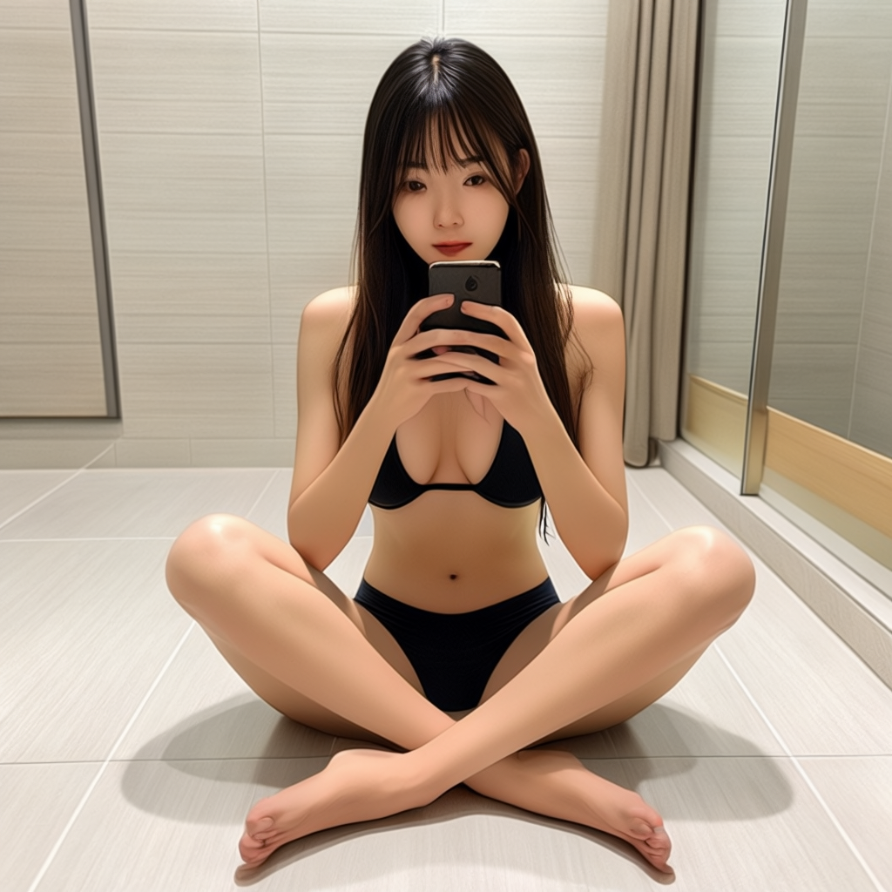

# Stable Cascade 图生图

参考 [Stable Cascade 文生图](../03.SC-txt2img/readme.md) 下载模型。  


## 下载工作流


工作流: [stable_cascade_image_to_image.json](./stable_cascade_image_to_image.json)  


## prompt


### 瓶子 


```
evening sunset scenery blue sky nature, glass bottle with a fizzy ice cold freezing rainbow liquid in it
```


输入图片:  comfyUI 的 example.png


输出:  


### 洗澡自拍  


```
mirror selfie, Chinese beautiful girl taking a photo while showering, sitting on floor, legs apart,   phone not covering body, focuses on showing the legs and figure, the posture should be natural and in line with the logic of real selfies, the body proportions should not be too exaggerated, and the mobile phone should reflect the reality, and restore the real female skin texture.
```

输入图片:  文生图的自拍图，基于这个图进一步生成新的图片。  





输入:  


## Next 

[Next](../05.SC-img-remixing/readme.md)
