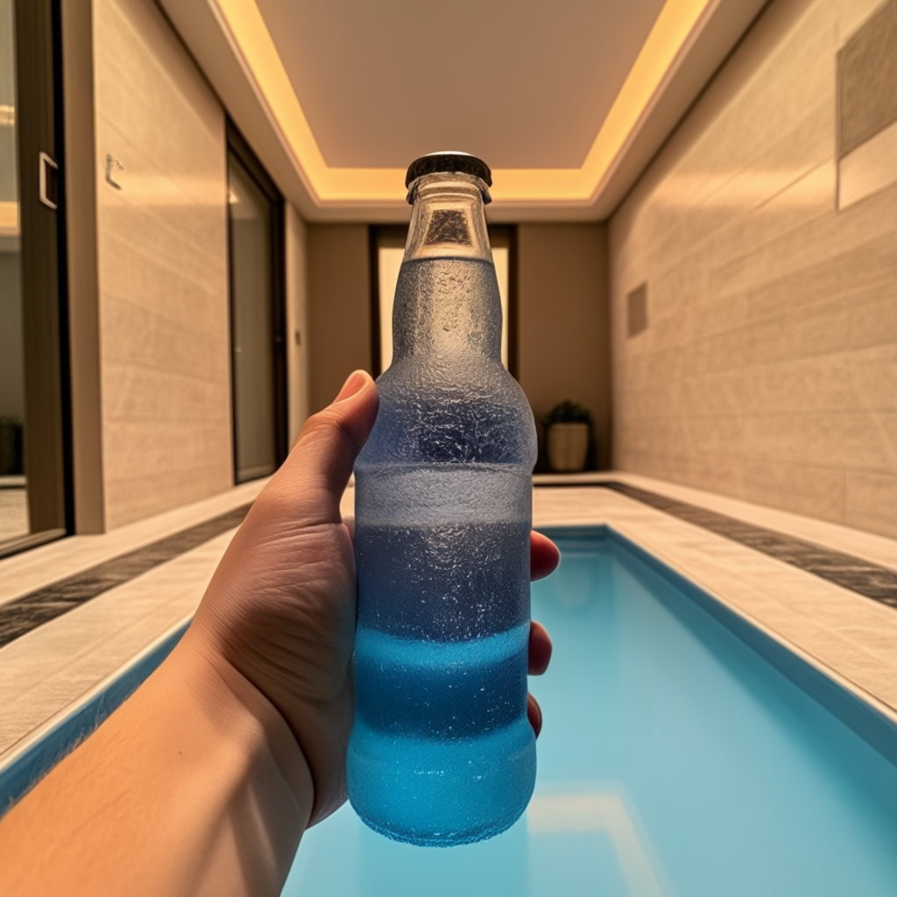

# Stable Cascade 图像变体（image variants）

参考 [Stable Cascade 文生图](../03.SC-txt2img/readme.md) 下载模型。  

Stable Cascade 支持使用 CLIP 视觉的输出创建图像的变体.


## 下载工作流


工作流: [stable_cascade_image_remixing.json](./stable_cascade_image_remixing.json)  


### 洗澡+瓶子  


```
evening sunset scenery blue sky nature, glass bottle with a fizzy ice cold freezing liquid in it
```


输入: 文生图的自拍图，基于这个图进一步生成新的图片。  


输出:  





### 自拍+样例图


输入: 文生图的自拍图，基于这个图进一步生成新的图片。


## Next 

[Next](../06.SC-img-remixing_multiple/readme.md)
