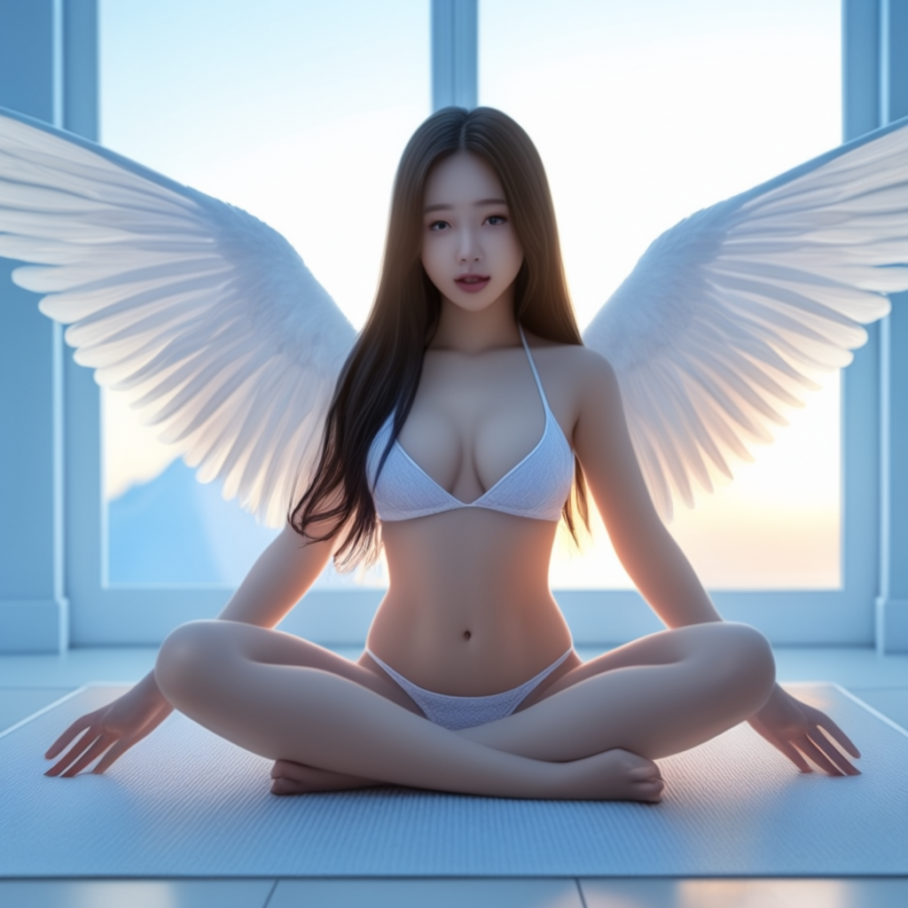
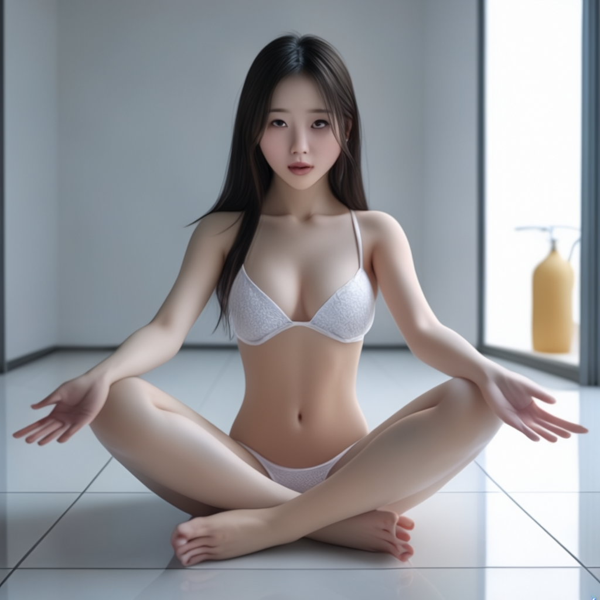
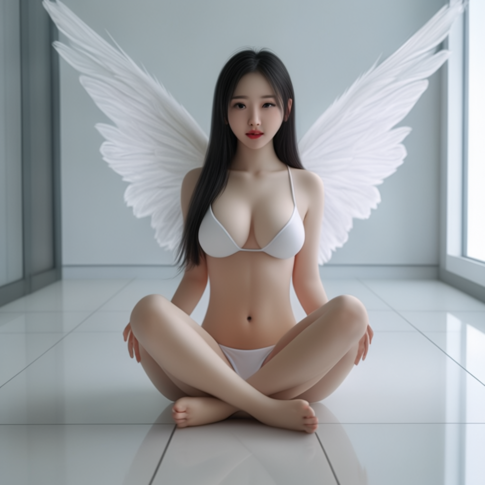

# Stable Cascade 多图片混合

参考 [Stable Cascade 文生图](../03.SC-txt2img/readme.md) 下载模型。  

以下的工作流程展示了如何将多个图片混合在一起来生成新的图片。

## 下载工作流

工作流: [stable_cascade_image_remixing_multiple.json](./stable_cascade_image_remixing_multiple.json)  

## prompt

简单理解，就是结合两个图片prompt 与 1个文本prompt，混合生成一个图片。  

### 手向下

### 手放膝盖上

### 手放腿上

## Next 

[Next](../07.SC-canny/readme.md)
