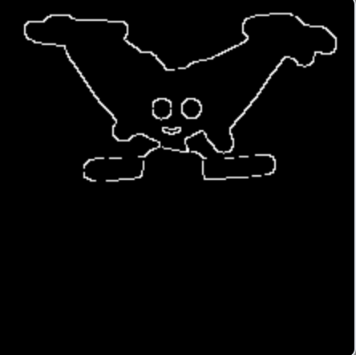

# Stable Cascade 多控制网络（ControlNet） canny

参考 [Stable Cascade 文生图](../03.SC-txt2img/readme.md) 下载模型。  


cany，根据输出的图片，识别出轮廓，然后基于轮廓，画出图片。  


## 下载工作流


工作流: [stable_cascade_canny_controlnet.json](./stable_cascade_canny_controlnet.json)  


## prompt


### 瓶子 + example


```
evening sunset scenery blue sky nature, glass bottle with a fizzy ice cold freezing rainbow liquid in it
```


输入图片:  


识别轮廓: 



输出图片: 


## Next 

[Next](../08.SC-inpainting/readme.md)
