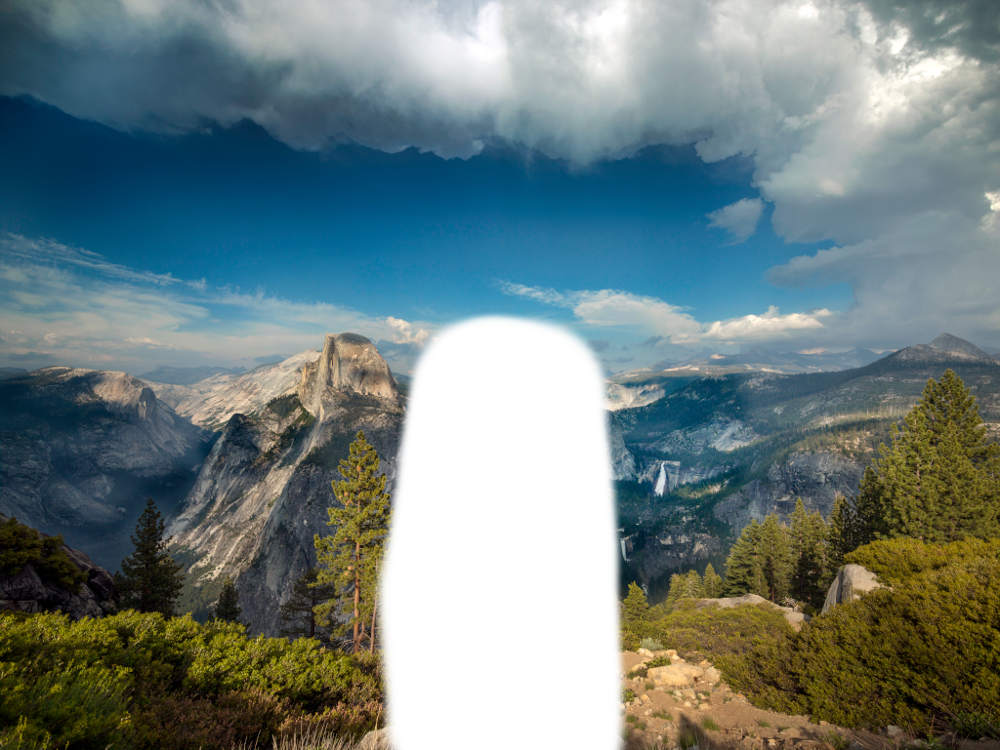
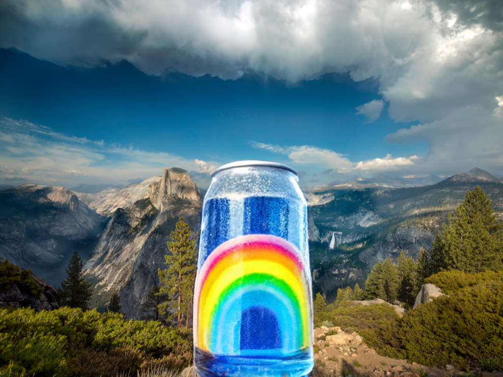
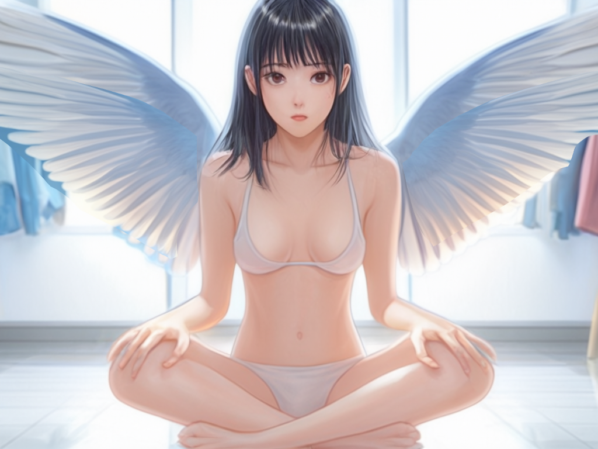

# Stable Cascade 多控制网络（ControlNet） Inpainting

参考 [Stable Cascade 文生图](../03.SC-txt2img/readme.md) 下载模型。  


Inpainting，根据输出的图片，指定局部位置进行重新生成。  


## 下载工作流


工作流: [stable_cascade_inpaint_controlnet.json](./stable_cascade_inpaint_controlnet.json)  


## prompt


### 瓶子 + inpaint_example


```
evening sunset scenery blue sky nature, glass bottle with a fizzy ice cold freezing rainbow liquid in it
```


输入图片:  


输出图片: 




### 洗澡自拍 + 重画


prompt: mirror selfie, Chinese beautiful girl taking a photo while showering, sitting on floor, legs apart,   phone not covering body, focuses on showing the legs and figure, the posture should be natural and in line with the logic of real selfies, the body proportions should not be too exaggerated, and the mobile phone should reflect the reality, and restore the real female skin texture.


输入图片：   


输出图片: 



