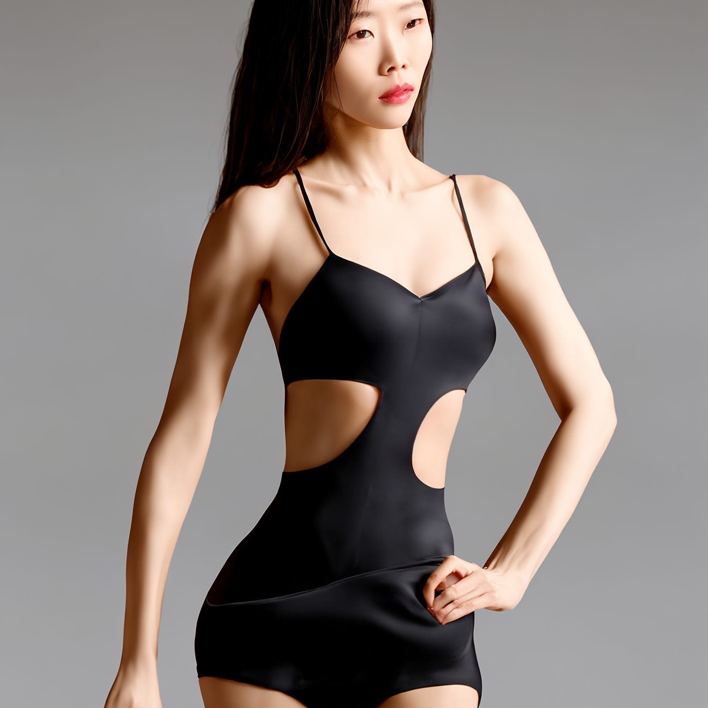
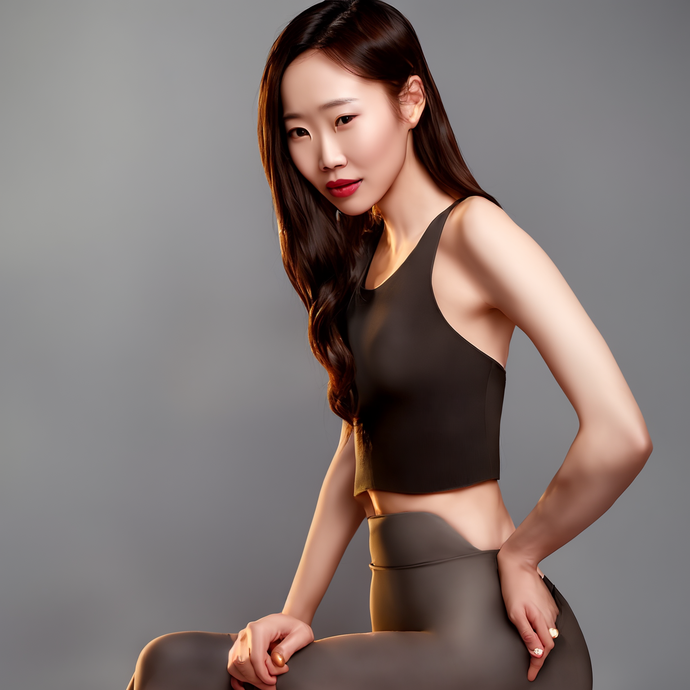

# 2 Pass Txt2Img (Hires fix) Examples

These are examples demonstrating how you can achieve the “Hires Fix” feature.
这些示例展示了如何实现“Hires Fix”功能。

Hires fix is just creating an image at a lower resolution, upscaling it and then sending it through img2img. 
Hires 的修复方法只是创建一个较低分辨率的图像，将其放大，然后通过 img2img 发送。

Note that in ComfyUI txt2img and img2img are the same node. 
请注意，在 ComfyUI 中，txt2img 和 img2img 是同一个节点。

Txt2Img is achieved by passing an empty image to the sampler node with maximum denoise.
txt2img 是通过将一个空图像传递给具有最大降噪效果的采样器节点来实现的。

## 模型下载

输入模型: v2-1_768-ema-pruned.safetensors
https://huggingface.co/stabilityai/stable-diffusion-2-1/resolve/main/v2-1_768-ema-pruned.safetensors?download=true

放大模型： RealESRGAN_x4plus.pth
https://github.com/xinntao/Real-ESRGAN/releases/download/v0.1.0/RealESRGAN_x4plus.pth

## 工作流

[hiresfix_esrgan_workflow](./hiresfix_esrgan_workflow.json)

### Non latent Upscaling  非潜在升级

Since ESRGAN operates in pixel space the image must be converted to pixel space and back to latent space after being upscaled.
由于 ESRGAN 在像素空间中运行，因此图像在升频后必须转换到像素空间，然后再转换回潜在空间。

## 效果

prompt: mirror selfie, Chinese beautiful girl taking a photo while showering, sitting on floor, legs apart,   phone not covering body, focuses on showing the legs and figure, the posture should be natural and in line with the logic of real selfies, the body proportions should not be too exaggerated, and the mobile phone should reflect the reality, and restore the real female skin texture.

输出图片:

