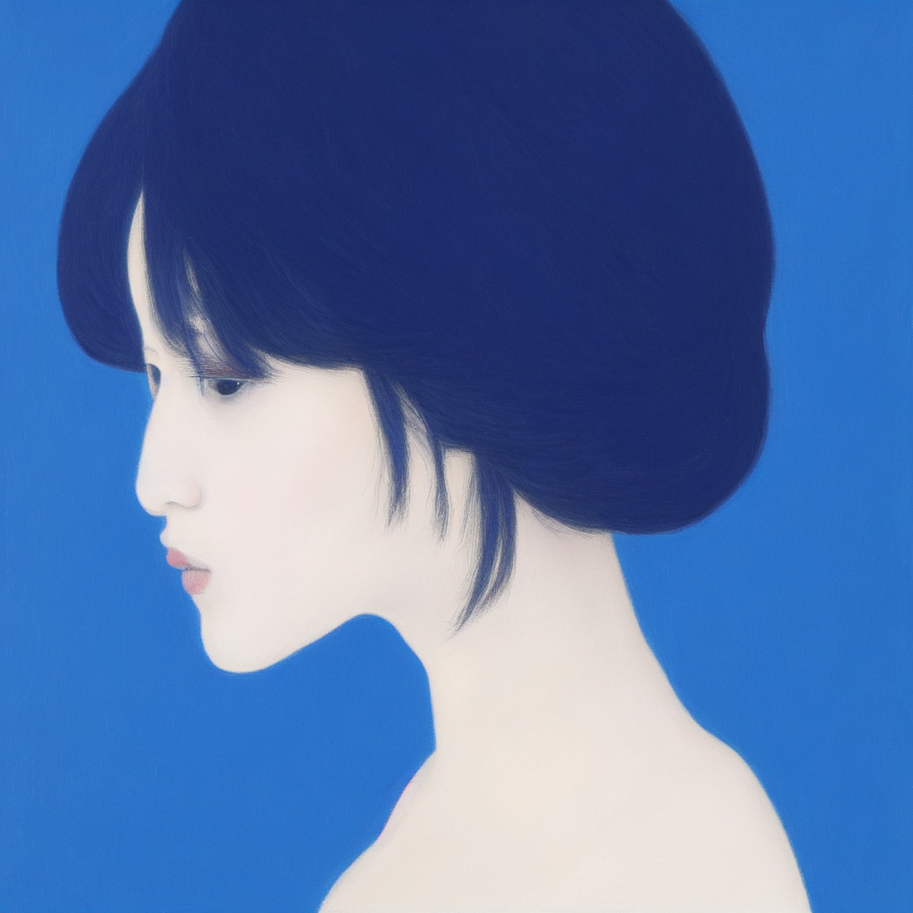

# Img2Img Examples

如果您仔细将本教程与文本到图像教程进行比较，您会注意到图像到图像的过程与文本到图像非常相似，只是增加了一个输入参考图像作为条件。

图像到图像（简称 img2img）是一种根据输入图像和文本提示生成新 AI 图像的方法。输出图像将遵循输入图像的颜色和构图。
输入图像仅供参考。它不需要漂亮或包含任何细节。重要的是颜色和构图。
提示要求与文本转图像相同。你可以将图像转图像视为文本转图像的泛化：文本转图像以随机噪声图像开始。图像转图像以指定的图像开始，然后添加噪声。

Image to Image 工作流程的关键在于 KSampler 节点中的 denoise 参数，该参数应小于 1

denoise 值越小，生成图像与参考图像的差异越小
denoise 值越大，生成的图像与参考图像的差异越大

这是因为 denoise 决定了转换参考图像后添加到潜在空间图像的噪声强度。如果 denoise 为 1，则潜在空间图像将变成完全随机的噪声，使其与 empty latent image 节点生成的潜在空间相同，从而失去参考图像的所有特征。

## 模型下载

下载 [v1-5-pruned-emaonly-fp16.safetensors](https://huggingface.co/Comfy-Org/stable-diffusion-v1-5-archive/resolve/main/v1-5-pruned-emaonly-fp16.safetensors?download=true) 并保存到 **ComfyUI/models/checkpoints** 文件夹下

v1-5：代表这是 Stable Diffusion 1.5 版本 的模型，这是 1.x 系列中非常流行和稳定的一版，生成质量高、兼容性好。

pruned：表示这个模型是经过“剪枝”处理的，也就是说，它移除了一些不必要的权重或冗余参数，通常是为了减小模型体积、加快推理速度。

emaonly：代表模型只保留了 Exponential Moving Average（EMA） 的权重版本。这通常是训练过程中保存的更“平滑”的模型，性能通常更稳定，推理效果也更好。

fp16：表示模型的权重是 16位浮点数格式（float16），这比常规的 32 位（float32）模型更小、更快、更适合 GPU 推理（尤其是消费级 GPU）。

.safetensors：这是 Hugging Face 等社区推广的 安全格式，用来代替 .ckpt。这个格式可以防止被注入恶意代码，比 .ckpt 更安全。

## 工作流

[image2image.json](./image2image.json)

## 效果

## 参考

https://stable-diffusion-art.com/img2img/

