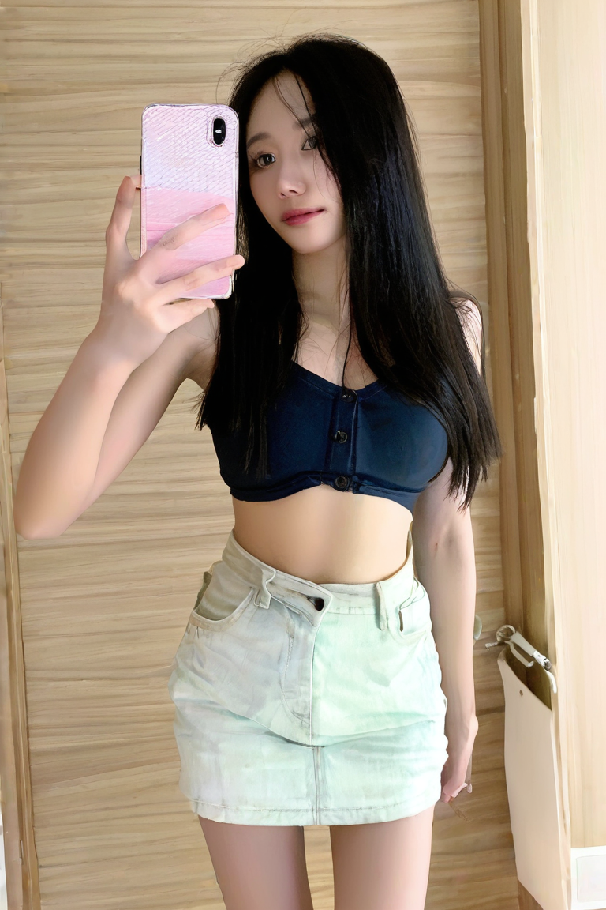
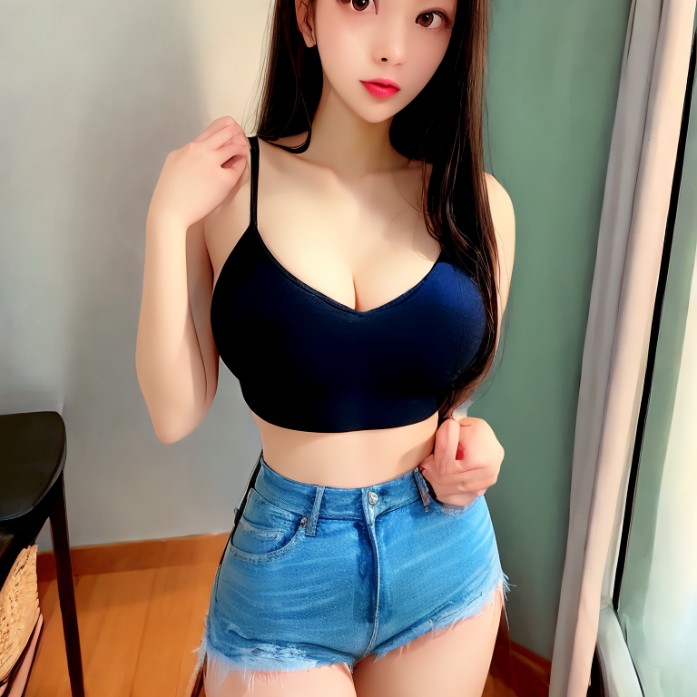

# unclip Model

“unCLIP” 是 OpenAI 在 CLIP 模型的基础上，推出的一种反向建模方法，主要应用在图像生成模型中。SD（Stable Diffusion）中有一类模型也使用了类似的机制，尤其是指融合了 CLIP 的 image-to-image 和 text-to-image 编码能力的模型。这种模型我们称之为 unCLIP 模型，或者也叫 图像编码驱动的扩散模型。

unCLIP 模型是 SD 模型的多个版本，经过特殊调整，除了文本提示外，还可以接收图像概念作为输入。图像使用这些模型自带的 CLIPVision 进行编码，然后在采样时将其提取的概念传递给主模型。
它基本上让你在提示中使用图像。

## 什么是 unCLIP？

unCLIP 是指从 CLIP 的图像编码（CLIP image embedding）反推（decode）生成原始图像的过程。简而言之，它是 CLIP 编码器的反向模型，目标是从 CLIP 编码中恢复出相应的图像。

## 原理概述

CLIP 本身是一个多模态模型，能够将文本和图像编码到同一个嵌入空间。unCLIP 使用这个空间的图像嵌入作为条件输入来生成图像：

1. CLIP Encoder：先将图像或文本编码为嵌入向量（embedding）。
2. Decoder（扩散模型）：接收图像嵌入作为条件，从噪声逐步生成图像（反扩散过程）。
3. 过程目标：重建与输入嵌入匹配的图像。

## 代表模型

- OpenAI DALL·E 2：最典型的 unCLIP 应用。它使用 CLIP 图像编码作为条件，通过扩散模型生成图像。
- Karlo (Kakao Brain)：韩国 Kakao 的开源图像生成模型，完全基于 unCLIP 架构。
- Stable Diffusion unCLIP 版（例如 DeepFloyd IF）：将 unCLIP 技术融合到扩散模型中的一种方式。

## 应用场景

- 图像编辑（通过图像嵌入调整）
- 图像风格迁移
- 图像修复（inpainting）
- 图像变体生成（通过修改 CLIP 嵌入）

## 模型下载

This stable-diffusion-2-1-unclip is a finetuned version of Stable Diffusion 2.1, modified to accept (noisy) CLIP image embedding in addition to the text prompt, and can be used to create image variations (Examples) or can be chained with text-to-image CLIP priors. The amount of noise added to the image embedding can be specified via the noise_level (0 means no noise, 1000 full noise).

stable-diffusion-2-1-unclip:  https://huggingface.co/stabilityai/stable-diffusion-2-1-unclip

### wd-1.5-beta2_unCLIP

https://huggingface.co/comfyanonymous/wd-1.5-beta2_unCLIP

Obtained by merging https://huggingface.co/waifu-diffusion/wd-1-5-beta2/tree/main/checkpoints with https://huggingface.co/stabilityai/stable-diffusion-2-1-unclip/tree/main
The exact recipe for the wd-1-5-beta2-aesthetic-unclip-h-fp32.safetensors is: (sd21-unclip-h.ckpt - v2-1_768-ema-pruned.ckpt) + wd-1-5-beta2-aesthetic-fp32.safetensors

### illuminatiDiffusionV1_v11_unCLIP

https://huggingface.co/comfyanonymous/illuminatiDiffusionV1_v11_unCLIP

illuminati-diffusion-v11 与 sd21-unclip-h 合并而成。  
Merge between https://civitai.com/models/11193/illuminati-diffusion-v11 and https://huggingface.co/stabilityai/stable-diffusion-2-1-unclip/blob/main/sd21-unclip-h.ckpt

 Illuminati Diffusion v1.1！这款先进的文本转图像扩散模型经过精心调整，能够生成高质量、美观的合成图像。
基于 Stable Diffusion 2.1，它通过对多样化数据集进行大量训练，提供了增强的深度、对比度和色彩。

## 参数

### unCLIPConditioning

- noise_augmentation: 控制模型对图像概念的遵循程度。值越低，模型对图像概念的遵循程度就越高。
- strength: 强度是指它对图像的影响有多强烈。

###  KSampler

sampler: uni_pc_bh2
scheduler: normal

## 效果  

输入图片：

### aesthetic-unclip-s0.1-n0.3

输出图片与输入图片完全无关。  

### aesthetic-unclip-s0.5-n0.3

输出图片：

### aesthetic-unclip-s0.75-n0.3

输出图片：

### aesthetic-unclip-s1.0-n0.3

输出图片：

## 参考

https://comfyanonymous.github.io/ComfyUI_examples/unclip/
