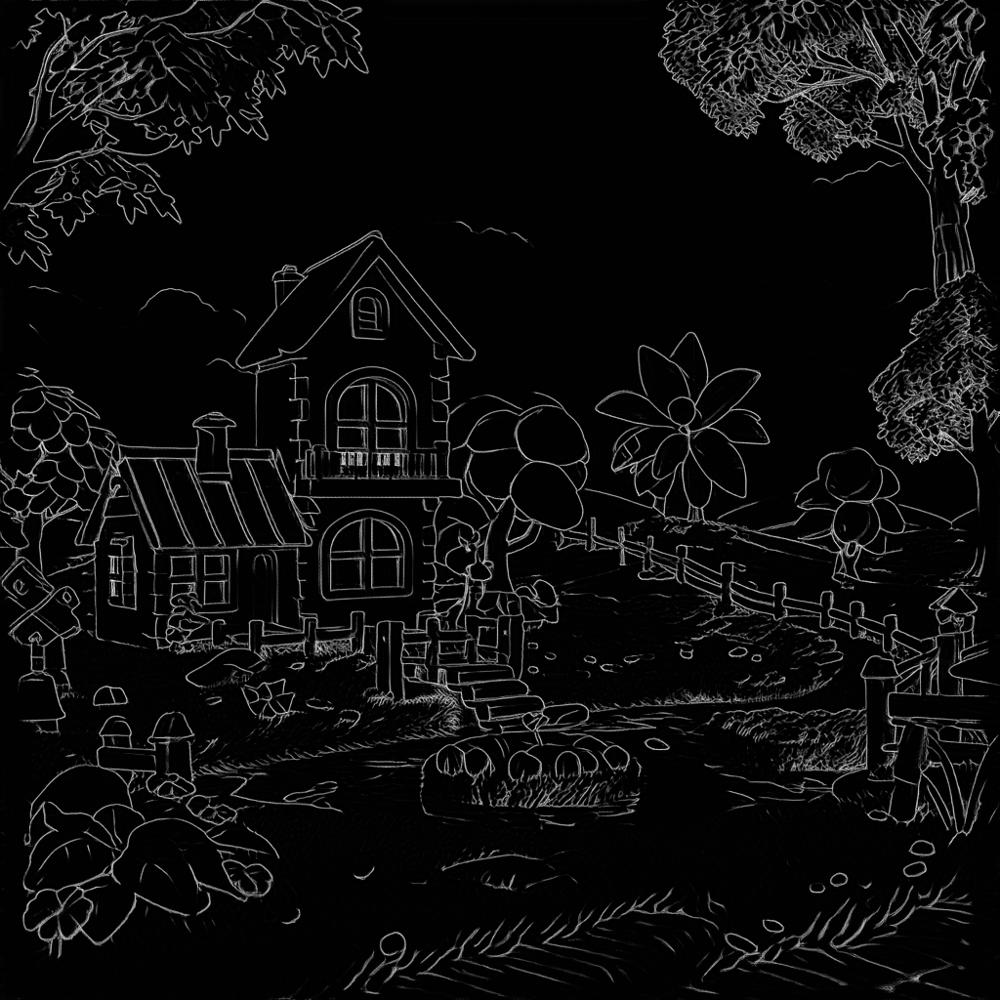

# Scribble ControlNet  涂鸦 ControlNet


## 介绍


在 AI 图像生成中实现对图像创建的精确控制不能一键完成。它通常需要多次生成尝试才能生成令人满意的图像。但是，ControlNet 的出现有效地解决了这一挑战。


ControlNet 模型通过引入多模态输入条件（如边缘检测图、深度图和姿势关键点），显著提高了图像生成的可控性和再现细节的能力。


## 下载

dreamCreationVirtual3DECommerce_v10.safetensors https://civitai.com/api/download/models/731340?type=Model&format=SafeTensor&size=full&fp=fp16
vae-ft-mse-840000-ema-pruned.safetensors https://huggingface.co/stabilityai/sd-vae-ft-mse-original/resolve/main/vae-ft-mse-840000-ema-pruned.safetensors?download=true
control_v11p_sd15_scribble_fp16.safetensors https://huggingface.co/comfyanonymous/ControlNet-v1-1_fp16_safetensors/resolve/main/control_v11p_sd15_scribble_fp16.safetensors?download=true


```
ComfyUI/
├── models/
│   ├── checkpoints/
│   │   └── dreamCreationVirtual3DECommerce_v10.safetensors
│   ├── vae/
│   │   └── vae-ft-mse-840000-ema-pruned.safetensors
│   └── controlnet/
│       └── control_v11p_sd15_scribble_fp16.safetensors
```


## 工作流


[controlnet_scribble.json](./controlnet_scribble.json)


## 效果

输入涂鸦：





输出图像:


## 参考


https://comfyanonymous.github.io/ComfyUI_examples/controlnet/#scribble-controlnet
