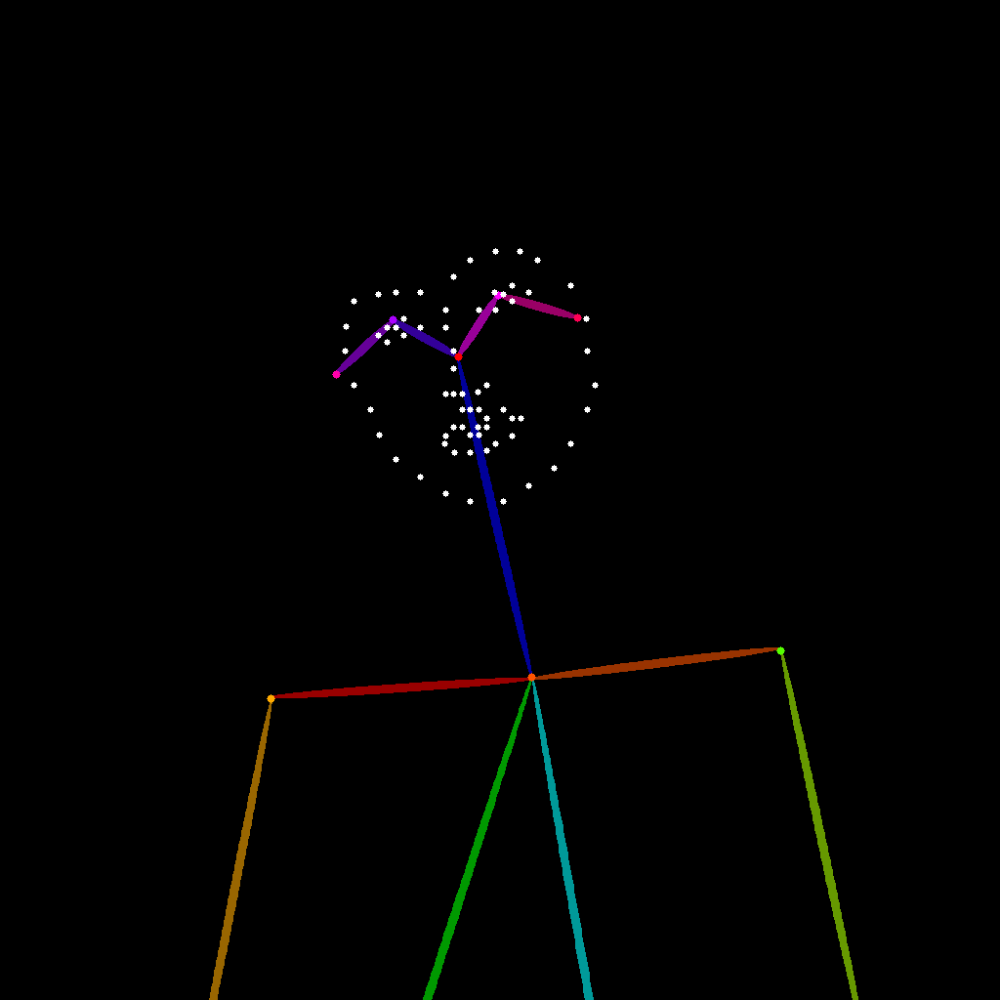

# Pose ControlNet  姿势 ControlNet


## 介绍

OpenPose 是由卡内基梅隆大学 （CMU） 开发的开源实时多人姿态估计系统，代表了计算机视觉领域的重大突破。该系统可以同时检测图像中的多个人，从而捕获：

Body skeleton: 18 keypoints, including head, shoulders, elbows, wrists, hips, knees, and ankles
身体骨骼 ：18 个关键点，包括头部、肩部、肘部、手腕、臀部、膝盖和脚踝
Facial expressions: 70 facial keypoints for capturing micro-expressions and facial contours
面部表情 ：70 个面部关键点，用于捕捉微表情和面部轮廓
Hand details: 21 hand keypoints for precisely expressing finger positions and gestures
指针细节 ：21 个指针关键点，用于精确表达手指位置和手势
Foot posture: 6 foot keypoints, recording standing postures and movement details
足部姿势 ：6 个足部关键点，记录站立姿势和动作细节


在 AI 图像生成中，OpenPose 生成的骨骼结构图作为 ControlNet 的条件输入，可以精确控制生成角色的姿势、动作和表情。
这使我们能够生成具有预期姿势和动作的逼真人物，大大提高了 AI 生成内容的可控性和实用价值。


## 模型下载

control_v11p_sd15_openpose_fp16.safetensors https://huggingface.co/comfyanonymous/ControlNet-v1-1_fp16_safetensors/resolve/main/control_v11p_sd15_openpose_fp16.safetensors?download=true
majicmixRealistic_v7.safetensors https://civitai.com/api/download/models/176425?type=Model&format=SafeTensor&size=pruned&fp=fp16
japaneseStyleRealistic_v20.safetensors https://civitai.com/api/download/models/85426?type=Model&format=SafeTensor&size=pruned&fp=fp16
vae-ft-mse-840000-ema-pruned.safetensors https://huggingface.co/stabilityai/sd-vae-ft-mse-original/resolve/main/vae-ft-mse-840000-ema-pruned.safetensors?download=true


```
ComfyUI/
├── models/
│   ├── checkpoints/
│   │   └── majicmixRealistic_v7.safetensors
│   │   └── japaneseStyleRealistic_v20.safetensors
│   ├── vae/
│   │   └── vae-ft-mse-840000-ema-pruned.safetensors
│   └── controlnet/
│       └── control_v11p_sd15_openpose_fp16.safetensors
```


## 工作流


[controlnet_pose_2_pass.json](./controlnet_pose_2_pass.json)


## 效果


输入 pos





输出结果


  


## 参考

https://docs.comfy.org/tutorials/controlnet/pose-controlnet-2-pass

