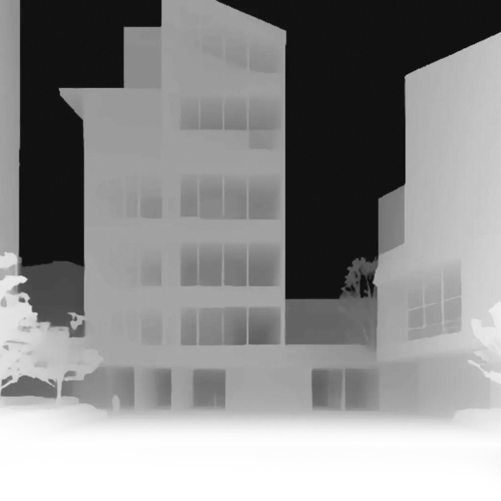
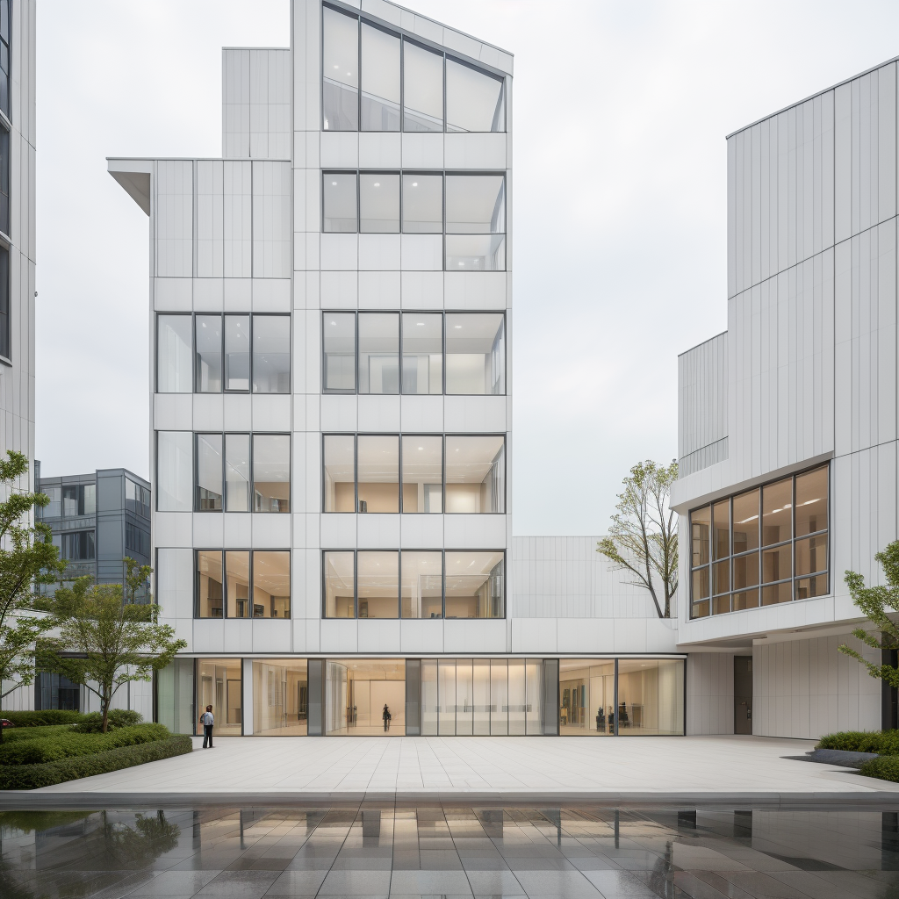

# Depth ControlNet


## 介绍


深度图是一种特殊类型的图像，它使用灰度值来表示场景中的对象与观察点或照相机之间的距离。


在深度图中，灰度值与距离成反比：较亮的区域（更接近白色）表示较近的对象，而较暗的区域（更接近黑色）表示较远的对象。


深度 ControlNet 是一种经过专门训练的 ControlNet 模型，用于理解和利用深度图信息。


它可以帮助 AI 正确解释空间关系，确保生成的图像符合深度图指定的空间结构，从而实现对三维空间布局的精确控制。


## 应用场景


Portrait Scenes: Control the spatial relationship between subjects and backgrounds, avoiding distortion in critical areas such as faces
人像场景 ：控制主体和背景之间的空间关系，避免面部等关键区域失真


Landscape Scenes: Control the hierarchical relationships between foreground, middle ground, and background
景观场景 ：控制前景、中间背景和背景之间的层次关系


Architectural Scenes: Control the spatial structure and perspective relationships of buildings
建筑场景 ：控制建筑物的空间结构和透视关系


Product Showcase: Control the separation and spatial positioning of products against their backgrounds
产品展示 ：控制产品与背景的分离和空间定位


## 模型


architecturerealmix_v11.safetensors https://civitai.com/api/download/models/431755?type=Model&format=SafeTensor&size=full&fp=fp16
control_v11f1p_sd15_depth_fp16.safetensors https://huggingface.co/comfyanonymous/ControlNet-v1-1_fp16_safetensors/resolve/main/control_v11f1p_sd15_depth_fp16.safetensors?download=true


```
ComfyUI/
├── models/
│   ├── checkpoints/
│   │   └── architecturerealmix_v11.safetensors
│   └── controlnet/
│       └── control_v11f1p_sd15_depth_fp16.safetensors
```


## 工作流


[controlnet_depth.json](./controlnet_depth.json)


## 效果


### 输入深度图: 




### ptompt: 


```
streamlined,special form building,white wall,curtain wall,window,indoor warm light,indoor spaces can be seen through the glass,front square,rain stains on the road,high saturation,masterpiece,high quality,8k,best quality,super Realistic,high detail,clean and tidy
```


### 输出：




## 参考

https://docs.comfy.org/tutorials/controlnet/depth-controlnet
