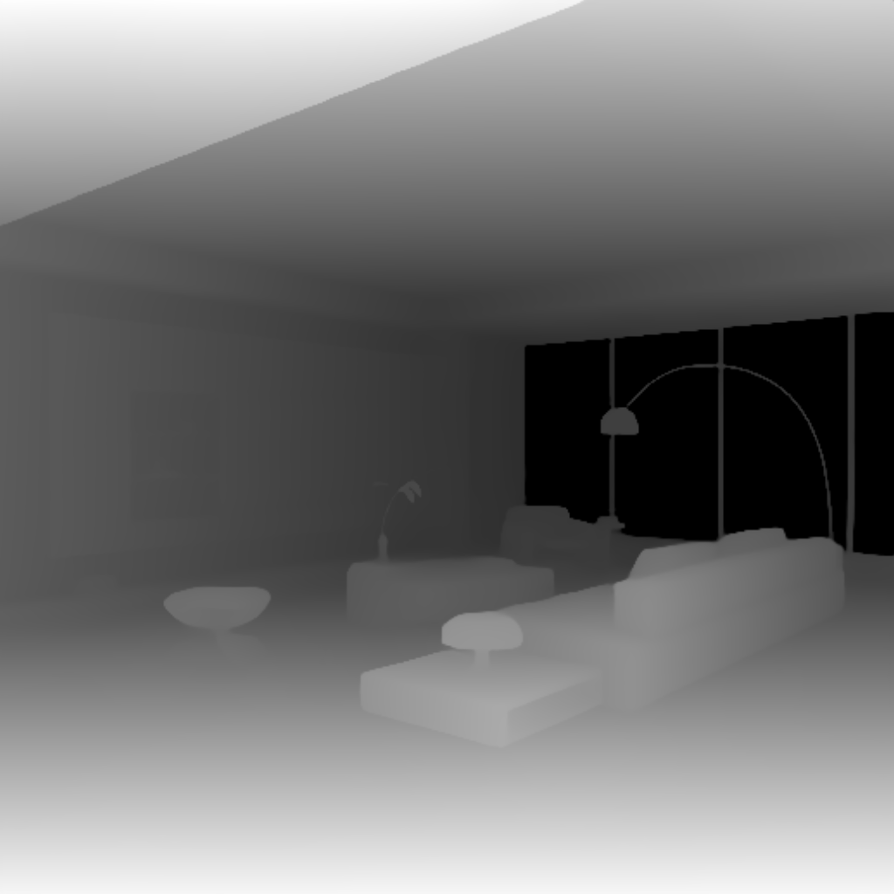
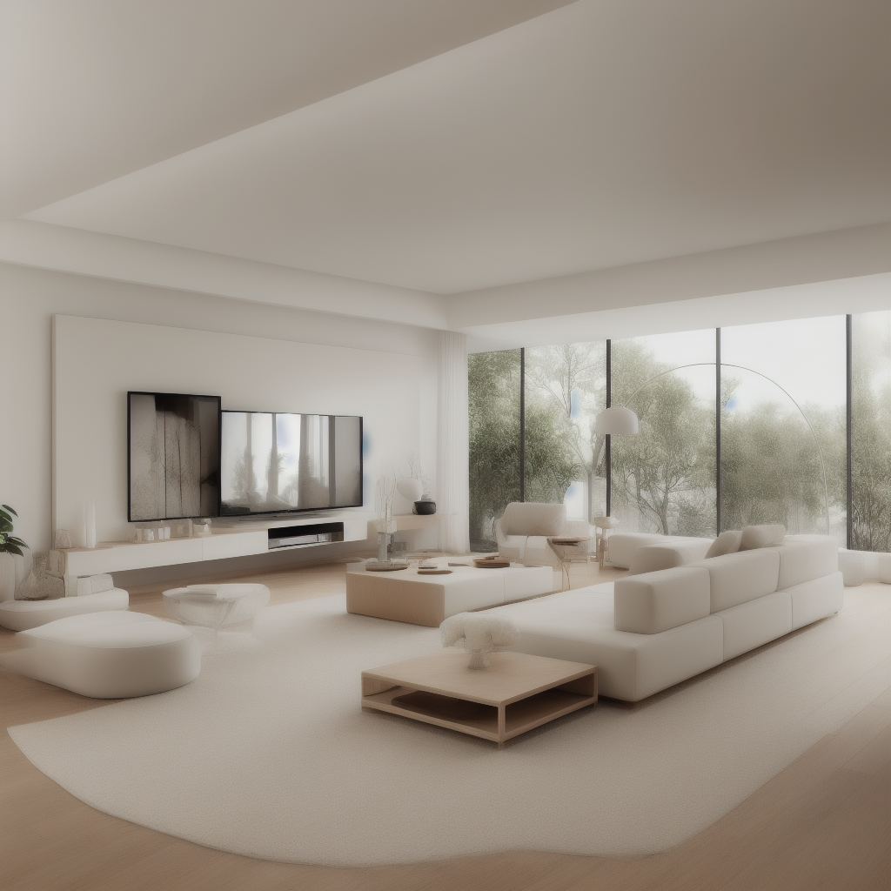

# Depth T2I 适配器


## 介绍

T2I-Adapter 是腾讯 ARC 实验室开发的一款轻量级适配器，旨在增强文本到图像生成模型（如 Stable Diffusion）的结构、颜色和样式控制能力。
https://huggingface.co/TencentARC/T2I-Adapter


它的工作原理是将外部条件（如边缘检测图、深度图、草图或彩色参考图像）与模型的内部特征对齐，在不修改原始模型结构的情况下实现高精度控制。


其推理速度仅约 77M 个参数（大小约为 300MB），比 ControlNet 快约 3 倍，并支持多种条件组合（如草图 + 彩色网格）。应用场景包括艺术线条到图像的转换、颜色样式迁移、多元素场景生成等。


## T2I Adapter VS ControlNet


尽管它们的功能相似，但在实现和应用上存在显著差异：

Lightweight Design: T2I Adapter has fewer parameters and a smaller memory footprint
轻量级设计 ：T2I 适配器具有更少的参数和更小的内存占用


Inference Speed: T2I Adapter is typically about 3 times faster than ControlNet
推理速度 ：T2I 适配器通常比 ControlNet 快 3 倍左右


Control Precision: ControlNet offers more precise control in certain scenarios, while T2I Adapter is more suitable for lightweight control
控制精度 ：ControlNet 在某些场景下提供更精确的控制，而 T2I 适配器更适合轻量级控制


Multi-condition Combination: T2I Adapter shows more significant resource advantages when combining multiple conditions
多条件组合 ：T2I 适配器在组合多个条件时表现出更显著的资源优势


## 功能

T2I 适配器提供多种类型来控制不同的方面：

Depth: Controls the spatial structure and depth relationships in images
深度 ：控制图像中的空间结构和深度关系


Line Art (Canny/Sketch): Controls image edges and lines
线条图（Canny/Sketch）： 控制图像边缘和线条


Keypose: Controls character poses and actions
Keypose：控制角色姿势和动作


Segmentation (Seg): Controls scene layout through semantic segmentation
分割 （Seg）： 通过语义分割控制场景布局


Color: Controls the overall color scheme of images
颜色 ：控制图像的整体颜色方案


## 应用


深度图在图像生成中有几个重要的应用：

Spatial Layout Control: Accurately describes three-dimensional spatial structures, suitable for interior design and architectural visualization
空间布局控制 ：准确描述三维空间结构，适用于室内设计和建筑可视化


Object Positioning: Controls the relative position and size of objects in a scene, suitable for product showcases and scene construction
对象定位 ：控制场景中对象的相对位置和大小，适用于产品展示和场景构建


Perspective Relationships: Maintains reasonable perspective and proportions, suitable for landscape and urban scene generation
透视关系 ：保持合理的透视和比例，适合景观和城市场景生成


Light and Shadow Layout: Natural light and shadow distribution based on depth information, enhancing realism
光影布局 ：基于深度信息的自然光影分布，增强真实感


## 模型

* interiordesignsuperm_v2.safetensors https://civitai.com/api/download/models/93152?type=Model&format=SafeTensor&size=full&fp=fp16
* t2iadapter_depth_sd15v2.pth https://huggingface.co/TencentARC/T2I-Adapter/resolve/main/models/t2iadapter_depth_sd15v2.pth?download=true
* t2i-adapter-lineart-sdxl-1.0 


```
ComfyUI/
├── models/
│   ├── checkpoints/
│   │   └── interiordesignsuperm_v2.safetensors
│   └── controlnet/
│       └── t2iadapter_depth_sd15v2.pth
```

## 工作流


[controlnet_depth-t2i-adapter.json](./controlnet_depth-t2i-adapter.json)


## 案例


### 输入图片：





### prompt:  


```
modern minimalist living room, pristine white sofa, wooden coffee table, large windows, city view with trees, cream color palette, beige carpet, wall mounted TV, white TV cabinet, arc floor lamp, indoor plants, natural lighting, spacious interior, clean lines, luxury apartment, professional photography, architectural digest, interior design magazine photo

masterpiece, best quality, photorealistic, 8k resolution, detailed texture, soft cinematic lighting
```

### 输出图片：





## 建议

### 输入图像质量优化


无论应用场景如何，高质量的输入图像都是成功使用 T2I 适配器的关键：


中等对比度 ：控制图像（如深度图、线条图）应具有清晰的对比度，但不能过于极端
清除边界 ：确保在控制图像中清晰区分主要结构和元素边界
杂色控制 ：尽量避免在控制图像中产生过多的杂色，尤其是对于深度图和线条图
合理的布局 ：控件图像应具有合理的空间布局和元素分布

### 组合多个条件

T2I 适配器的一个主要优点是它能够轻松组合多个条件以获得复杂的控制效果：


深度 + 边缘 ：控制空间布局，同时保持清晰的结构边缘，适用于建筑和室内设计
线条艺术 + 颜色 ：在指定配色方案的同时控制形状，适用于角色设计和插图
姿势 + 分割 ：在定义场景区域的同时控制角色动作，适用于复杂的叙事场景


## 参考


https://docs.comfy.org/tutorials/controlnet/depth-t2i-adapter

