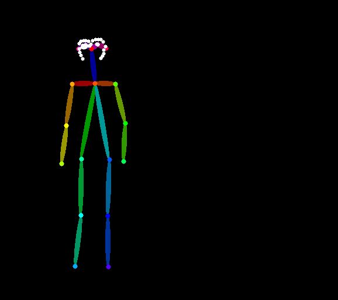

# 混合 ControlNet


## 简介

在 AI 图像生成中，单一的控制条件往往无法满足复杂场景的要求。混合多个 ControlNet 允许您同时控制图像的不同区域或方面，从而实现对图像生成的更精确控制。

在某些情况下，混合 ControlNet 可以利用不同控制条件的特性来实现更精细的条件控制：


场景复杂性 ：复杂的场景需要多个控制条件协同工作
细粒度控制 ：通过调整每个 ControlNet 的强度参数，您可以精确控制每个部分的影响程度
互补效果 ：不同类型的 ControlNet 可以相互补充，弥补单个控件的限制
创意表达 ：组合不同的控件可以产生独特的创意效果


混合多个 ControlNet 时，每个 ControlNet 都会根据其应用区域影响图像生成过程。ComfyUI 允许通过 Apply ControlNet 节点中的链式连接以分层方式按顺序应用多个 ControlNet 条件。


## 工作流


[controlnets_mixing.json](./controlnets_mixing.json)  


## 演示


### 输入 pose 图片


  


### 输入 scribble 图片


  


### prompt


```
1girl, beautiful ,1Cat
```


### 输出图片


## 参考

https://docs.comfy.org/tutorials/controlnet/mixing-controlnets

