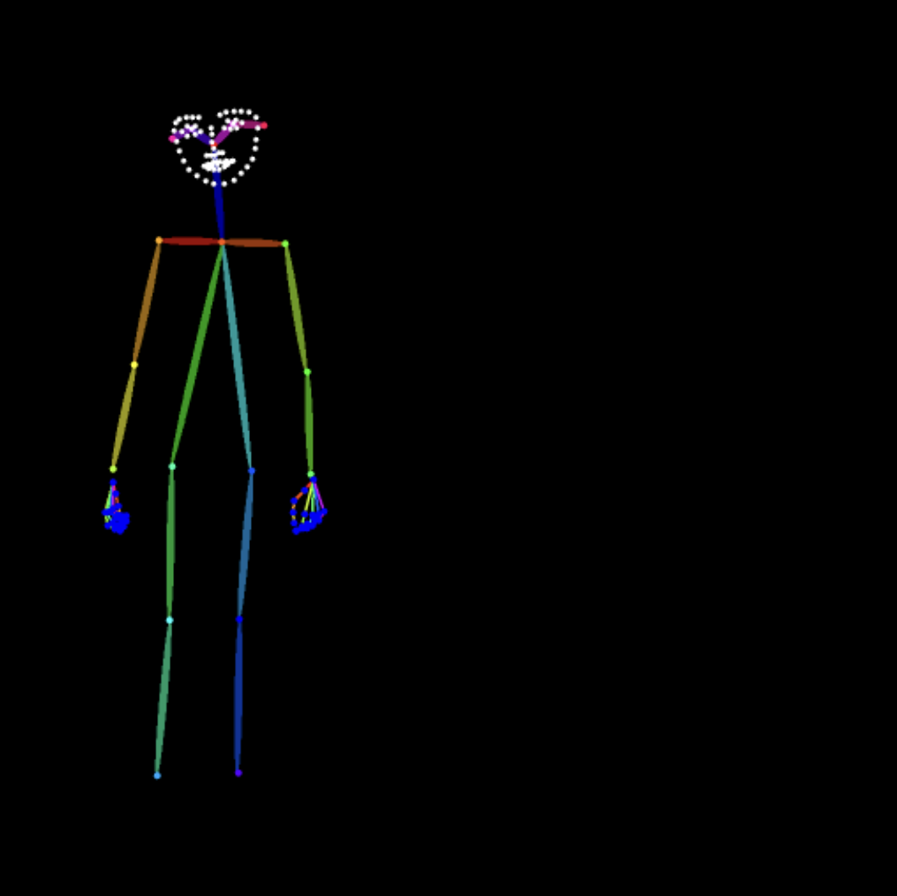
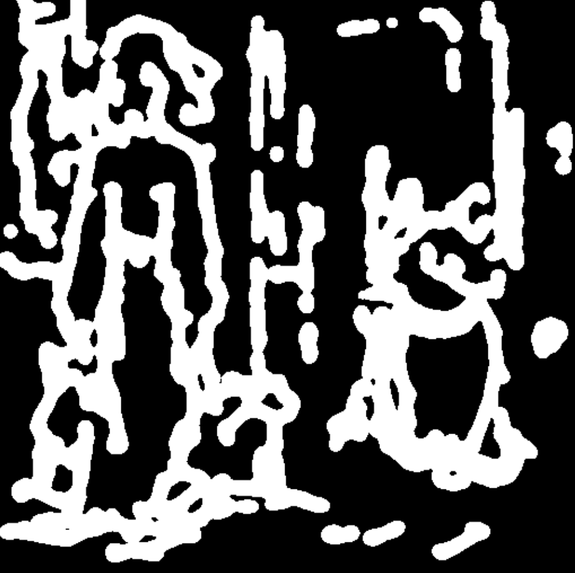

# 图片转 pos,canny,scribble  

## 介绍

在学习 controlnet 的时候，我们通过输入一个 pos/depth/canny 图片，可以画出一个 pos/depth/canny 相关的图片。 

平常我们也没有这些  pos/depth/canny 图片的，所以需要输入一个图片来生成  pos/depth/canny 图片。  

分四类节点：Pose、canny、Scribble、Depth，下面分类来看。  

## Pose  

Pose 有四个 node。  

| 节点|  示例 |
|:-:|:-:|
|OpenPose Pose|  |
| DWPose Estimator|  |
|AnimalPose Estimator (AP10K)|  |
|DensePose Estimator|  |

## Scribble

| 节点|  示例 |
|:-:|:-:|
|Scribble Lines|  |
|Scribble XDoG Lines|  |
|Scribble PiDiNet Lines|  |
|Fake Scribble Lines (aka scribble_hed)|  |

## Canny

| 节点|  示例 |
|:-:|:-:|
|Canny|   |
|Canny Edge|  |
|PyraCanny|  |

## depth

| 节点|  示例 |
|:-:|:-:|
|Depth Anything|   |
|Depth Anything V2 |  |
|MiDaS Depth Map|  |
|LeReS Depth Map |  |
|Zoe Depth Anything|  |
