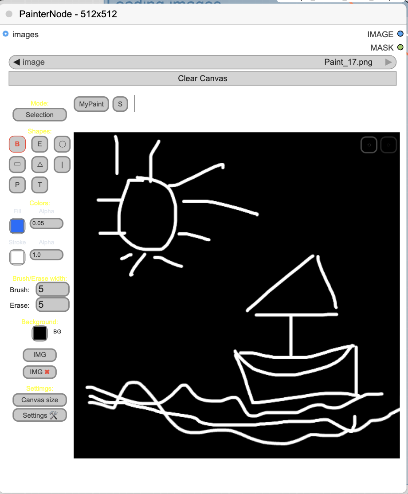
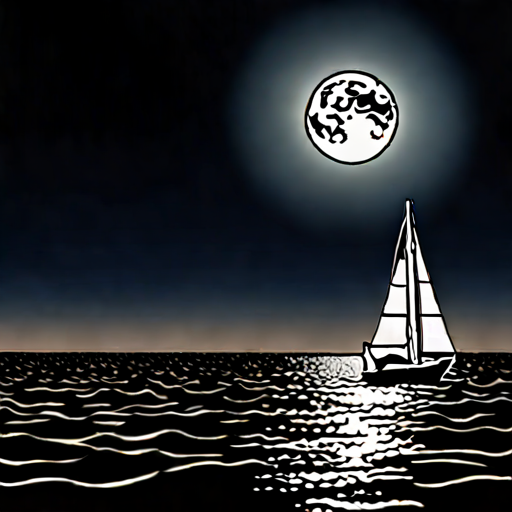

# 涂鸦生图  

## 介绍

首先我们将 Load Image 节点替换成 Painter Node，你会看到 Painter Node 就是一个简单的画板。

另外，为了实现边画边生成，还需要将 Checkpoint 的模型换成 SDXL Turbo，并且将 KSampler 上的 step 改成 1，cfg 改成 1。

## 工作流

  

## 效果

prompt: sailboat， moon, sea

输入：画一个月亮、小船、波浪

  

输出：

## 参考

https://www.comflowy.com/zh-CN/expert/drawing-to-image

