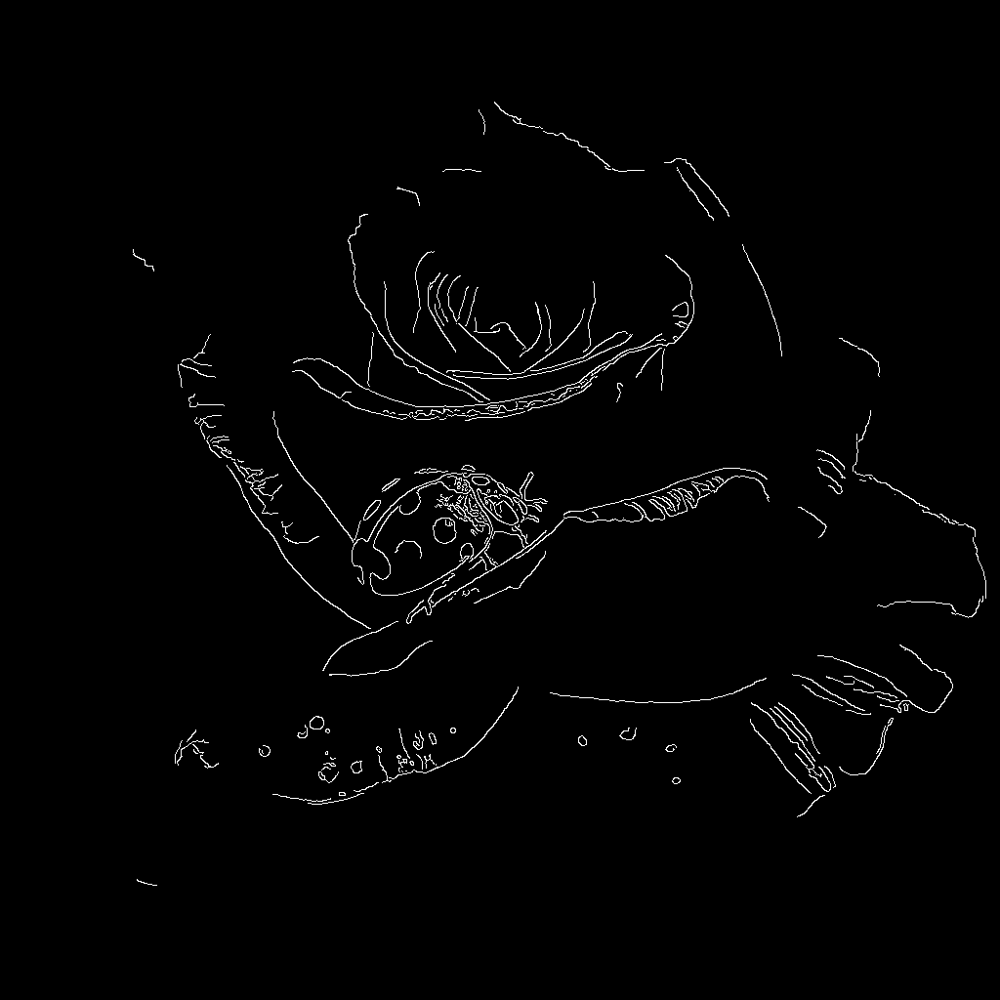

# Flux.1 ControlNet


## 简介

FLUX.1 Canny 和 Depth 是黑森林实验室推出的 FLUX.1 Tools 中的两个强大模型。该工具包旨在为 FLUX.1 添加控制和引导功能，使用户能够修改和重新创建真实或生成的图像。

FLUX.1-Depth-dev 和 FLUX.1-Canny-dev 都是 12B 参数的 Rectified Flow Transformer 模型，可以根据文本描述生成图像，同时保持输入图像的结构特征。

Depth 版本通过深度图提取技术保持源图像的空间结构，而 Canny 版本则利用边缘检测技术保留源图像的结构特征，用户可以根据不同的需求选择合适的控制方式。


两种型号均具有以下特点：

顶级输出质量和细节表现
出色的快速跟随能力，同时保持与原始图像的一致性
使用引导式蒸馏技术进行培训以提高效率
为研究界开放权重
API 接口（专业版）和开源权重（开发版）


此外，Black Forest Labs 还提供从完整模型中提取的 FLUX.1-Depth-dev-lora 和 FLUX.1-Canny-dev-lora 适配器版本。这些版本可以应用于 FLUX.1 dev 基础模型，以更小的文件大小提供类似的功能，尤其适用于资源受限的环境。


## FLUX.1-Canny-dev


### 目录 


```
ComfyUI/
├── models/
│   ├── text_encoders/
│   │   ├── clip_l.safetensors
│   │   └── t5xxl_fp16.safetensors
│   ├── vae/
│   │   └── ae.safetensors
│   └── diffusion_models/
│       └── flux1-canny-dev.safetensors
```


### 模型下载

clip_l.safetensors https://huggingface.co/comfyanonymous/flux_text_encoders/resolve/main/clip_l.safetensors?download=true
t5xxl_fp16.safetensors https://huggingface.co/comfyanonymous/flux_text_encoders/resolve/main/t5xxl_fp16.safetensors?download=true
ae.safetensors https://huggingface.co/black-forest-labs/FLUX.1-schnell/resolve/main/ae.safetensors?download=true
flux1-canny-dev.safetensors https://huggingface.co/black-forest-labs/FLUX.1-Canny-dev/resolve/main/flux1-canny-dev.safetensors?download=true


### 工作流


[flux-1-canny-dev.json](./flux-1-canny-dev.json)  


### 效果

prompt: Hyperrealistic digital artwork. This hyperrealistic digital artwork shows a vivid close-up scene of a bright red ladybug perched on a delicate, half-opened yellow rose. The rose petals are intricately detailed, velvety-soft, and richly hued, with a gradient pale yellow edge. The ladybug is centrally located, its signature red shell adorned with seven black dots and a small yellow-orange head. Dew drops add a fresh, dewy quality to the petals, which shimmer in natural light. The background features rose blossoms in various stages of bloom, adding depth and a sense of lushness to the rose bush. The overall richness of the color palette, with the yellow and bright red of the rose and ladybug contrasting against the cool tones of the background, enhances the vivid realism of the artwork.


输入图片:  


输出图片:  


## FLUX.1-Depth-dev


### 目录 


```
ComfyUI/
├── models/
│   ├── text_encoders/
│   │   ├── clip_l.safetensors
│   │   └── t5xxl_fp16.safetensors
│   ├── vae/
│   │   └── ae.safetensors
│   └── diffusion_models/
│       └── flux1-depth-dev.safetensors
```


### 模型下载

clip_l.safetensors https://huggingface.co/comfyanonymous/flux_text_encoders/resolve/main/clip_l.safetensors?download=true
t5xxl_fp16.safetensors https://huggingface.co/comfyanonymous/flux_text_encoders/resolve/main/t5xxl_fp16.safetensors?download=true
ae.safetensors https://huggingface.co/black-forest-labs/FLUX.1-schnell/resolve/main/ae.safetensors?download=true
flux1-depth-dev.safetensors https://huggingface.co/black-forest-labs/FLUX.1-Depth-dev/resolve/main/flux1-depth-dev.safetensors?download=true


## FLUX.1-Canny-dev-lora


## FLUX.1-Depth-dev-lora


### 目录

```
ComfyUI/
├── models/
│   ├── text_encoders/
│   │   ├── clip_l.safetensors
│   │   └── t5xxl_fp16.safetensors
│   ├── vae/
│   │   └── ae.safetensors
│   ├── diffusion_models/
│   │   └── flux1-dev.safetensors
│   └── loras/
│       └── flux1-depth-dev-lora.safetensors
```


### 模型下载

clip_l.safetensors https://huggingface.co/comfyanonymous/flux_text_encoders/resolve/main/clip_l.safetensors?download=true
t5xxl_fp16.safetensors https://huggingface.co/comfyanonymous/flux_text_encoders/resolve/main/t5xxl_fp16.safetensors?download=true
ae.safetensors https://huggingface.co/black-forest-labs/FLUX.1-schnell/resolve/main/ae.safetensors?download=true
flux1-dev.safetensors https://huggingface.co/black-forest-labs/FLUX.1-dev/resolve/main/flux1-dev.safetensors?download=true
flux1-depth-dev-lora.safetensors https://huggingface.co/black-forest-labs/FLUX.1-Depth-dev-lora/resolve/main/flux1-depth-dev-lora.safetensors?download=true


### 工作流

[](./flux-1-depth-dev-lora.json)  


### 效果


prompt:  of a CGI-rendered, whimsical, white plastic figurine of a cartoon ghost. The ghost stands upright on a smooth, white marble surface, which is the focal point of the image. Its exaggerated, cartoonish features include large, round, black eyes, a small black nose, and an open mouth revealing a red tongue, giving it a startled or surprised expression. The ghost's arms are outstretched, and its fingers are bent in a playful, friendly manner. The background is softly blurred, featuring a warm, cozy setting. There is a wooden cabinet or dresser to the left, adorned with a small, glowing, orange lamp emitting a soft light, creating a warm ambiance. The lamp's soft glow contrasts with the ghost's stark white color. On the right side of the background, there is a small, teal-colored bowl and a few other indistinct, muted objects, suggesting a homey, lived-in environment. The overall mood of the image is playful and endearing, with a touch of nostalgia, emphasizing the ghost as a friendly, cute presence in a cozy home setting.


输出图片: 


输出图片:  


## 参考

https://docs.comfy.org/tutorials/flux/flux-1-controlnet

